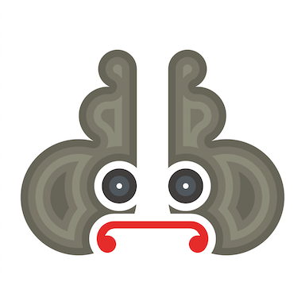

<p align="center">
  
</p>

# Artisan

Artisan is an MVVM framework for Swift using the bonding features from [Pharos](https://github.com/hainayanda/Pharos), constraints builder from [Draftsman](https://github.com/hainayanda/Draftsman) and builder pattern from [Builder](https://github.com/hainayanda/Builder).

[](https://codebeat.co/projects/github-com-hainayanda-artisan-main)


[](https://swift.org/package-manager/)
[](https://cocoapods.org/pods/Artisan)
[](https://cocoapods.org/pods/Artisan)
[](https://cocoapods.org/pods/Artisan)

## Example

To run the example project, clone the repo, and run `pod install` from the Example directory first.

## Requirements

- Swift 5.3 or higher
- iOS 10.0 or higher
- XCode 12.5 or higher


## Installation

### Cocoapods

Artisan is available through [CocoaPods](https://cocoapods.org). To install
it, simply add the following line to your Podfile:

```ruby
pod 'Artisan', '~> 5.0.0'
```

### Swift Package Manager from XCode

- Set rules at **version**, with **Up to Next Major** option and put **5.0.0** as its version
- Add it using XCode menu **File > Swift Package > Add Package Dependency**
- Add **https://github.com/hainayanda/Artisan.git** as Swift Package URL
- Click next and wait

### Swift Package Manager from Package.swift

Add as your target dependency in **Package.swift**

```swift
dependencies: [
    .package(url: "https://github.com/hainayanda/Artisan.git", .upToNextMajor(from: "5.0.0"))
]
```

Use it in your target as `Artisan`

```swift
 .target(
    name: "MyModule",
    dependencies: ["Artisan"]
)
```

## Author

Nayanda Haberty, hainayanda@outlook.com

## License

Artisan is available under the MIT license. See the [LICENSE](LICENSE) file for more info.

## Usage

Read [wiki](https://github.com/hainayanda/Artisan/wiki) for more detailed information.

### Basic Usage

Creating an MVVM Pattern using Artisan is easy. Binding is supported by [Pharos](https://github.com/hainayanda/Pharos) and View building is supported by [Draftsman](https://github.com/hainayanda/Draftsman), Artisan is the one that make both can work with each other perfectly.
 Like if you want to create simple Search Screen:

```swift
import UIKit
import Artisan
import Draftsman
import Builder
import Pharos

class SearchScreen: UIPlannedController, ViewBindable {
    
    typealias Model = SearchScreenViewModel
    
    @Subject var allResults: [Result] = []
    
    // MARK: View
    lazy var searchBar: UISearchBar = builder(UISearchBar.self)
        .placeholder("Search here!")
        .sizeToFit()
        .tintColor(.text)
        .barTintColor(.background)
        .delegate(self)
        .build()
    
    lazy var tableView: UITableView = builder(UITableView.self)
        .backgroundColor(.clear)
        .separatorStyle(.none)
        .allowsSelection(true)
        .delegate(self)
        .build()
    
    @LayoutPlan
    var viewPlan: ViewPlan {
        tableView.drf
            .edges.equal(with: .parent)
            .cells(from: $allResults) { _, result in
                Cell(from: ResultCell.self) { cell, _ in
                    cell.apply(result)
                }
            }
    }
    
    override func viewDidLoad() {
        super.viewDidLoad()
        view.backgroundColor = .background
        tableView.keyboardDismissMode = .onDrag
        applyPlan()
    }
    
    override func viewWillAppear(_ animated: Bool) {
        super.viewWillAppear(animated)
        navigationController?.navigationBar.tintColor = .main
        navigationItem.titleView = searchBar
    }
    
    func viewNeedBind(with model: Model) {
        model.searchPhraseBindable
            .bind(with: searchBar.bindables.text)
            .observe(on: .main)
            .retained(by: self)
        model.resultsObservable
            .relayChanges(to: $allResults)
            .observe(on: .main)
            .retained(by: self)
            .fire()
    }
    
    // more code for UITableViewDelegate and UISearchbarDelegate below
    ...
    ...
    ...
    
}
```

with ViewModel protocol like this:

```swift
protocol SearchScreenDataBinding {
    var searchPhraseBindable: BindableObservable<String?> { get }
    var resultsObservable: Observable<[Result]> { get }
}

protocol SearchScreenSubscriber {
    func didTap(_ event: Result, at indexPath: IndexPath)
}

typealias SearchScreenViewModel = ViewModel & SearchScreenSubscriber & SearchScreenDataBinding
```

It will create a View using `Draftsman` and bind `Model` to `View` using `Pharos`. As you can see from the code above, it will bind `searchBar.bindables.text` with `searchPhraseBindable` from `Model` relay changes from `resultsObservable` to `allResults`.
This then will make sure that every changes coming from `searchBar` will be relayed to the `Model` and then every results changes from `Model` will be relayed back to the `View`. The results then will be observed by `UITableView` built-in datasource (provided by Artisan and powered by [DiffableDataSource](https://github.com/ra1028/DiffableDataSources)) for then used to update a cells in the `UITableView`.

You can create your ViewModel like this:

```swift
import UIKit
import Artisan
import Pharos
import Impose

// MARK: ViewModel

class SearchScreenVM: SearchScreenViewModel, ObjectRetainer {
    
    @Injected var service: EventService
    
    let router: SearchRouting
    
    @Subject var searchPhrase: String?
    @Subject var results: [Result] = []
    
    // MARK: Data Binding
    
    var searchPhraseBindable: BindableObservable<String?> { $searchPhrase }
    
    var resultsObservable: Observable<[Result]> { $results }
    
    init(router: SearchRouting) {
        self.router = router
        $searchPhrase
            .whenDidSet(thenDo: method(of: self, SearchScreenVM.search(for:)))
            .multipleSetDelayed(by: 1)
            .retained(by: self)
            .fire()
        
    }
}

// MARK: Subscriber

extension EventSearchScreenVM {
    func didTap(_ history: HistoryResult, at indexPath: IndexPath) {
        searchPhrase = history.distinctifier as? String
    }
    
    func didTap(_ event: EventResult, at indexPath: IndexPath) {
        guard let tappedEvent = event.distinctifier as? Event else { return }
        router.routeToDetails(of: tappedEvent)
    }
}

// MARK: Extensions

extension EventSearchScreenVM {
    
    func search(for changes: Changes<String?>) {
        service.doSearch(withSearchPhrase: changes.new ?? "") { [weak self] results in
            self?.results = results
        }
    }
}
```

Then binding the `View` and `Model` will be as easy like this:

```swift
let searchScreen = SearchScreen()
let searchRouter = SearchRouter(screen: searchScreen)
let searchScreenVM = SearchScreenVM(router: searchRouter)
searchScreen.bind(with: searchScreenVM)
```

Don't forget that everytime `BindableView` is bind with new `ViewModel`, all of its old retained Pharos relay will be released.

You can clone and check the [Example folder](https://github.com/hainayanda/Artisan/tree/main/Example) or for more wiki, go to [here](https://github.com/hainayanda/Artisan/wiki)

## Contribute

You know how, just clone and do pull request
